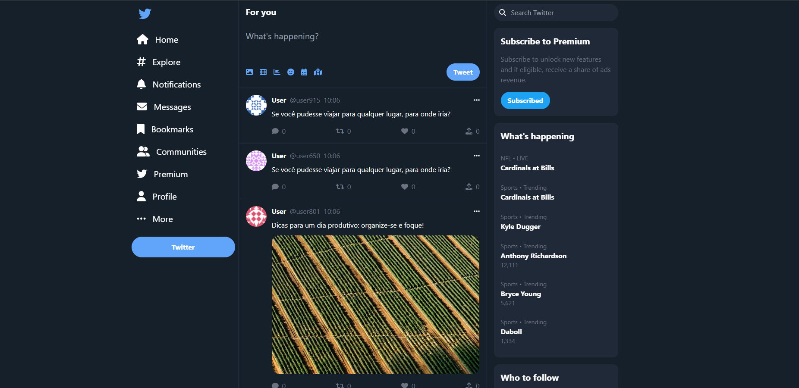

# Twitter Clone

A full-stack Twitter-inspired social media application built with **Django REST Framework** and **React + TypeScript**.

The project was created to strengthen my knowledge of API design, authentication, and frontend-backend integration using modern development practices.

## 📸 Screenshot

Add your application screenshot below:

```markdown

```

## 🚀 Tech Stack

### Backend

* Django
* Django REST Framework
* PostgreSQL (Docker - local development)
* SQLite (production)
* Poetry
* Pytest

### Frontend

* React
* TypeScript
* Tailwind CSS
* Axios
* React Router

## ✨ Features

* User registration and authentication
* Create, edit, delete tweets
* Follow and unfollow users
* Notifications system
* Admin dashboard
* RESTful API
* Automated tests


## 📡 API Base Route

```
/api/v1/
```

### Main Endpoints

| Resource      | Endpoint          |
| ------------- | ----------------- |
| Users         | `/users/`         |
| Tweets        | `/tweets/`        |
| Follows       | `/follows/`       |
| Notifications | `/notifications/` |

All endpoints support standard CRUD operations.

Admin panel available at:

```markdown
/admin/
```

## 🛠 Backend Setup

```bash
git clone https://github.com/analiceleite/twitter_clone.git
cd twitter_clone
poetry install
poetry run python manage.py migrate
poetry run python manage.py runserver
```

Optional (PostgreSQL with Docker):

```bash
docker-compose up -d
```

Run tests:

```bash
poetry run python manage.py test
```

## 🎨 Frontend Setup

```bash
cd frontend/twitter_clone
npm install
npm start
```

Update API base URL inside:

```markdown
src/api/base_api
```

## 🔐 Authentication

* Token and session authentication supported
* Permission-based access control
* Superuser access for admin panel

## 🔮 Future Improvements

* Pagination
* Tweet replies
* Likes and retweets
* UI enhancements

## 🤝 Contributing

Pull requests and suggestions are welcome.
